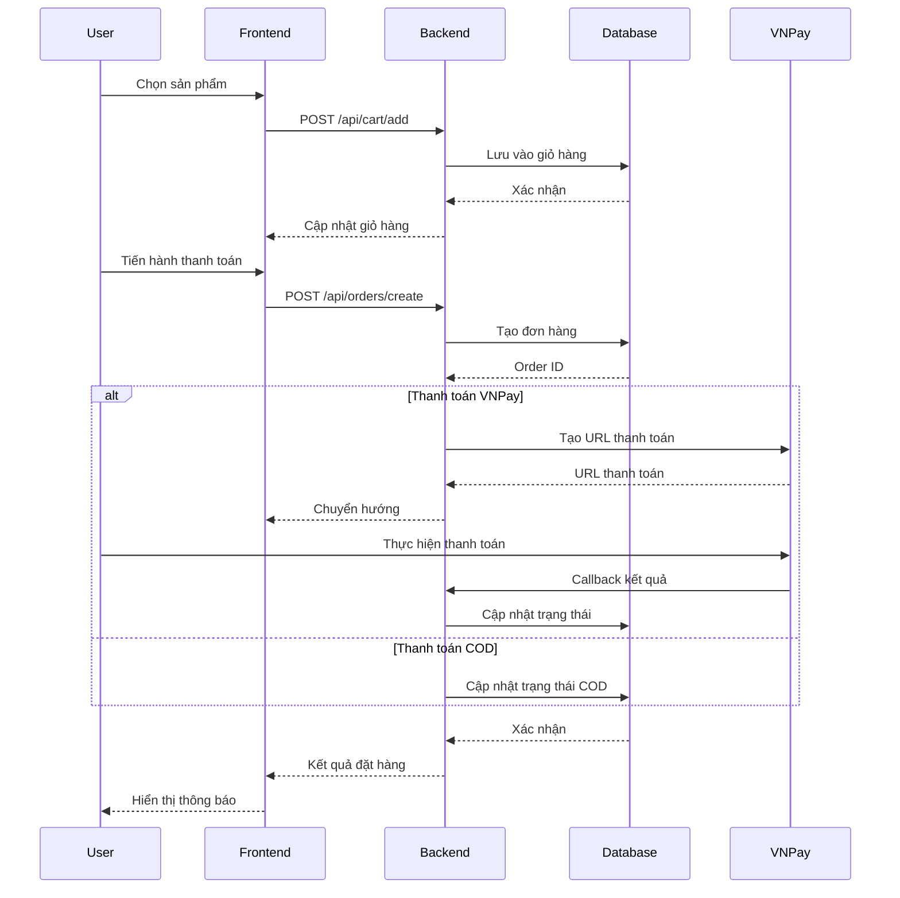

# PC Store Website Giới Thiệu và Bán Máy PC Trực Tuyến

# Chương 1: Giới Thiệu Đề Tài

## 1.1. Giới Thiệu Thành Viên Nhóm

### Phân Công Nhiệm Vụ và Đánh Giá (CLO1)

| Họ và Tên          | MSSV   | Nhiệm Vụ                                                        | Đánh Giá |
| ------------------ | ------ | --------------------------------------------------------------- | -------- |
| [Tên thành viên 1] | [MSSV] | Phát triển Frontend Thiết kế UI/UX Tích hợp API           | [Điểm]   |
| [Tên thành viên 2] | [MSSV] | Phát triển Backend Thiết kế Database Xử lý Authentication | [Điểm]   |

## 1.2. Giới Thiệu Đề Tài

Trong thời đại công nghệ 4.0, nhu cầu mua sắm trực tuyến ngày càng phát triển mạnh mẽ. Việc xây dựng một nền tảng thương mại điện tử chuyên biệt không chỉ giúp kết nối nhà cung cấp với người tiêu dùng mà còn tối ưu hóa trải nghiệm mua sắm của khách hàng. Đề tài "Website giới thiệu và bán máy PC trực tuyến" được xây dựng nhằm cung cấp một giải pháp toàn diện, hỗ trợ khách hàng dễ dàng tìm kiếm, so sánh và đặt mua các sản phẩm máy tính cá nhân (PC) theo nhu cầu.

Ứng dụng sử dụng Java Spring Boot một framework hiện đại và mạnh mẽ để xây dựng hệ thống backend. Đây là công nghệ phổ biến với khả năng mở rộng cao, giúp tối ưu hóa hiệu suất và dễ dàng tích hợp với các công nghệ hiện đại như Hibernate, Spring Security và RESTful API. Đồng thởi, giao diện người dùng sẽ được thiết kế thân thiện, trực quan, đảm bảo người dùng có thể dễ dàng tương tác, từ việc tìm kiếm sản phẩm đến hoàn tất thanh toán.

## 1.3. Mục Tiêu Thực Hiện Đề Tài

### 1.3.1. Mục Tiêu Chung

Xây dựng một nền tảng thương mại điện tử hoàn chỉnh, chuyên biệt về lĩnh vực PC và linh kiện máy tính.
Tạo ra một hệ thống an toàn, ổn định và dễ dàng mở rộng trong tương lai.
Tối ưu hóa trải nghiệm người dùng từ khâu tìm kiếm đến thanh toán.

### 1.3.2. Mục Tiêu Cụ Thể

1. Về Chức Năng:
   Xây dựng hệ thống quản lý sản phẩm đa dạng với nhiều danh mục
   Phát triển tính năng tìm kiếm và lọc sản phẩm thông minh
   Tích hợp hệ thống thanh toán trực tuyến an toàn (VNPay)
   Thiết lập hệ thống quản lý đơn hàng và theo dõi trạng thái
   Xây dựng hệ thống xác thực và phân quyền người dùng

2. Về Giao Diện:
   Thiết kế giao diện responsive, tương thích đa nền tảng
   Tối ưu hóa UX/UI theo các tiêu chuẩn hiện đại
   Xây dựng giao diện quản trị trực quan, dễ sử dụng

3. Về Kỹ Thuật:
   Áp dụng kiến trúc microservices cho khả năng mở rộng
   Đảm bảo hiệu suất và tốc độ tải trang
   Tích hợp các biện pháp bảo mật tiên tiến
   Xây dựng API có tính tái sử dụng cao

# Chương 2: Phân Tích Yêu Cầu (CLO3)

## 2.1. Yêu Cầu Chức Năng

### 2.1.1. Quản Lý Người Dùng

Đăng ký tài khoản
Đăng nhập/Đăng xuất
Quản lý thông tin cá nhân
Phân quyền người dùng (Admin, User)

### 2.1.2. Quản Lý Sản Phẩm

Thêm/Sửa/Xóa sản phẩm
Phân loại sản phẩm
Tìm kiếm và lọc sản phẩm
Hiển thị chi tiết sản phẩm

### 2.1.3. Quản Lý Đơn Hàng

Tạo đơn hàng mới
Theo dõi trạng thái đơn hàng
Xử lý đơn hàng (Admin)
Lịch sử đơn hàng

### 2.1.4. Thanh Toán

Tích hợp VNPay
Quản lý giỏ hàng
Xác nhận đơn hàng

## 2.2. Yêu Cầu Phi Chức Năng

**Hiệu Suất**: Thời gian phản hồi nhanh, tối ưu hóa tải trang
**Bảo Mật**: Đảm bảo an toàn thông tin người dùng và giao dịch
**Khả Năng Mở Rộng**: Dễ dàng thêm tính năng mới và mở rộng quy mô
**Độ Tin Cậy**: Hệ thống ổn định, có khả năng phục hồi sau sự cố
**Tính Sẵn Sàng**: Đảm bảo thời gian hoạt động cao

# Chương 3: Phân Tích Thiết Kế (CLO4, CLO5)

## 3.1. Screen Diagram

## 3.2. Use Case Diagram

## 3.3. Activity Diagram

### Quy Trình Đặt Hàng

### Quy Trình Xử Lý Đơn Hàng (Admin)

## 3.4. Class Diagram

## 3.5. Sequence Diagram

### Quy Trình Đặt Hàng

## 3.6. Database Diagram

# Chương 4: Hiện Thực Ứng Dụng (CLO4, CLO5, CLO6)

## 4.1. Frontend

### Công Nghệ Sử Dụng

**Công nghệ chính**: React + TypeScript + Vite
**UI Framework**: Tailwind CSS với các components tùy chỉnh
**State Management**: Redux Toolkit
**Routing**: React Router DOM
**Form Validation**: Zod
**HTTP Client**: Axios
**UI Components**:
Radix UI cho các components cơ bản
Custom components với Tailwind CSS
Lucide React cho icons

### Cấu Trúc Frontend

### Chi Tiết Cấu Trúc Thư Mục

#### Frontend Structure

- **assets/**: Static files như images, fonts
- **components/**
  - **common/**: Các components dùng chung
  - **ui/**: UI components (buttons, inputs, etc.)
- **features/**: Feature-based modules
  - **auth/**: Authentication related
  - **cart/**: Shopping cart
  - **order/**: Order management
  - **product/**: Product catalog
  - **user/**: User management
- **hooks/**: Custom React hooks
- **layouts/**: Layout components
- **lib/**: Third-party library configurations
- **pages/**: Page components
- **services/**: API services
- **store/**: Redux store configuration
- **types/**: TypeScript type definitions
- **utils/**: Utility functions

## 4.2. Backend

### Công Nghệ Sử Dụng

Spring Boot 3.3.5
Java 21
MongoDB
JWT Authentication
VNPay Payment Integration

### Cấu Trúc Backend

### Chi Tiết Cấu Trúc Thư Mục

#### Backend Structure

- **config/**: Configuration classes
- **controller/**: REST API endpoints
- **dto/**: Data Transfer Objects
- **entity/**: Database entities
- **exception/**: Custom exceptions
- **repository/**: Data access layer
- **security/**: Security configurations
- **service/**: Business logic
- **util/**: Utility classes

# Chương 5: Kết Luận

## 5.1. Kết Quả Đạt Được

Hoàn thành các chức năng cơ bản của hệ thống
Xây dựng được giao diện người dùng thân thiện
Tích hợp thành công hệ thống thanh toán
Đảm bảo các yêu cầu về bảo mật và hiệu suất

## 5.2. Hạn Chế

[Liệt kê các hạn chế]

## 5.3. Hướng Phát Triển

Bổ sung thêm phương thức thanh toán
Phát triển tính năng đánh giá sản phẩm
Tích hợp chatbot hỗ trợ khách hàng
Tối ưu hóa SEO
Phát triển ứng dụng mobile

# Tài Liệu Tham Khảo (CLO2)

1. Spring Framework Documentation
   https://docs.spring.io/spring-framework/reference/
   Sử dụng cho việc phát triển backend với Spring Boot

2. React Documentation
   https://react.dev/
   Tham khảo cho việc xây dựng frontend

3. MongoDB Documentation
   https://www.mongodb.com/docs/
   Hướng dẫn thiết kế và quản lý cơ sở dữ liệu

4. [Các tài liệu tham khảo khác]
